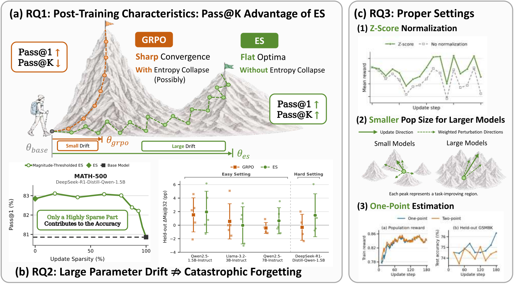

<h1 align="center">理解用于大语言模型推理的进化策略</h1>

<p align="center"><strong>相比 GRPO 具有更广的推理覆盖范围</strong></p>

<p align="center">
  <a href="https://arxiv.org/abs/2608.27351">论文</a> ·
  <a href="README.md">English</a> ·
  <a href="https://github.com/yunpengba7/understanding-es">代码</a>
</p>

<p align="center"><strong>Yunpeng Ba¹<sup>*</sup> · Zhi Zheng²<sup>*</sup> · Yue Xie¹ · Jiaqing Li⁵ · Xialiang Tong³ · Tao Zhong³ · Mingxuan Yuan³ · Zhichao Lu⁴ · Xuyang Wu¹ · Zhenkun Wang¹</strong></p>

<p align="center">
  ¹ 南方科技大学<br>
  ² 新加坡国立大学<br>
  ³ 华为诺亚方舟实验室<br>
  ⁴ 香港城市大学<br>
  ⁵ 哈尔滨工业大学（威海）
</p>

<p align="center"><sup>*</sup> 共同第一作者。</p>

<p align="center"><strong>通讯：</strong><a href="mailto:zhi.zheng@u.nus.edu">zhi.zheng@u.nus.edu</a> · <a href="mailto:wangzhenkun90@gmail.com">wangzhenkun90@gmail.com</a></p>

## 摘要

进化策略（Evolution Strategies，ES）最近作为一种显存高效的大语言模型推理后训练范式受到关注。然而，ES 的优化行为仍缺乏充分研究，因此其相对于主流后训练范式（例如群组相对策略优化，GRPO）的优势范围仍难以界定。通过系统研究 ES 的动态与机制，本文**首先发现了 ES 相对于 GRPO 的性能优势**，并从理论和实验两方面表明，ES 能够带来更广的推理覆盖，从而更充分地利用预训练大语言模型的推理能力。理论上，我们证明 ES 种群中经验证器投影的 Jensen–Shannon 多样性有助于获得更高的 Pass@$K$。实验上，与出现熵坍缩的 GRPO 不同，ES 在提升 Pass@1 的同时获得了比 GRPO 更高的 Pass@$K$。我们进一步提出顺序式 GRPO–ES 训练策略，将 GRPO 在 Pass@1 上的优势与 ES 在 Pass@$K$ 上的增益结合起来。**其次，**我们发现，尽管整个模型发生了显著的参数漂移，ES 的任务性能增益只来源于一个稀疏的大幅更新子集。这种功能稀疏性表明，大幅参数移动并不一定意味着广泛的功能变化；留出任务评估进一步表明，它也不一定会导致灾难性遗忘。**最后，**我们研究超参数设计如何影响 ES 的有效性，并表明模型规模越大，ES 所需的种群规模越小。这些发现表明，ES 是一种独立的推理后训练范式，而不是一种效果较弱、仅具显存效率优势的 GRPO 替代方案。

## 为什么使用进化策略？💡

[](assets/readme/rq123_overview.pdf)

*图 1：三个研究问题及主要发现的总览。面板 (a) 对比 ES 与 GRPO 的后训练行为；面板 (b) 表明保留幅度较大的 ES 更新能够保持目标任务性能，并报告留出任务 Maj@32 的变化；面板 (c) 总结归一化、种群规模和估计器选择。点击预览图可打开该图的 PDF 版本。*

其中，**Maj@32** 表示对 32 个采样回答进行多数投票后得到的准确率。

论文围绕三个研究问题展开：

- **RQ1：ES 是否表现出与 GRPO 相同的后训练特征？** 我们发现，ES 比 GRPO 保留了更广的推理覆盖。在使用 GSM8K 和 DeepScaleR 后训练的多个模型上，ES 在提升 Pass@1 的同时获得了比 GRPO 更高的 Pass@$K$，且没有出现相同的熵坍缩。理论上，我们证明 ES 种群中经验证器投影的 Jensen–Shannon 多样性能够提高重复采样成功率，并可转化为 ES 更新后策略中更高的 Pass@$K$。我们进一步提出 ES$\rightarrow$GRPO 和 GRPO$\rightarrow$ES 两种顺序组合，将 GRPO 在 Pass@1 上的优势与 ES 在 Pass@$K$ 上的增益结合起来。
- **RQ2：ES 是否必然导致灾难性遗忘？** 通过考察参数变化的分布，我们发现，ES 中与任务相关的作用集中在一个较小的大幅更新子集，而扰动相消后，大部分参数变化贡献很小。这种功能稀疏性表明，显著的全模型参数漂移并不一定对应广泛的功能变化。与此一致，在适当训练设置下，留出能力基本得到保持，说明大幅参数移动本身并不意味着灾难性遗忘，先前的观察更适合由训练集过拟合来解释。
- **RQ3：哪些超参数设置和估计器能使 ES 有效且可扩展？** 我们系统评估 ES 超参数和估计器设计，以确定稳定且有效的配置。我们发现，z-score 奖励归一化是有效 ES 训练的关键因素。由于推理奖励具有离散性，零阶 SFT 中通常更受青睐的 two-point 估计器并未为 ES 带来优势。我们还发现，预训练模型规模越大，有效优化所需的种群规模越小。

### 主要结果

| 研究问题 | 论文报告的主要发现 | 本仓库提供的证据 |
| --- | --- | --- |
| RQ1：ES 与 GRPO | ES 保留更广的推理覆盖，提升 Pass@1，获得比 GRPO 更高的 Pass@$K$，并支持具有互补优势的顺序组合 | 仅包含 `Qwen2.5-1.5B-Instruct` Easy Setting 的基座/ES 端点；不包含 GRPO、顺序组合和完整 Pass@$K$ 评测套件 |
| RQ2：参数漂移与遗忘 | ES 增益集中在稀疏的大幅更新子集；显著全模型漂移并不一定意味着灾难性遗忘 | 仅包含 checkpoint 导出和运行来源记录；不包含更新稀疏性和留出任务评估 |
| RQ3：ES 设计选择 | z-score 归一化十分重要，two-point 估计在匹配的 GSM8K 实验中没有优势，且模型越大所需种群越小 | 仅包含选定的 z-score、种群 32、单点估计配置；不包含完整的超参数和估计器消融实验 |

本仓库提供的端点参考结果为：

| 模型 | Greedy | Pass@1 | Pass@16 | Pass@32 |
| --- | ---: | ---: | ---: | ---: |
| `Qwen2.5-1.5B-Instruct`（基座 checkpoint） | 988 / 1,319 | 0.702710 | 0.948300 | 0.963609 |
| `Qwen2.5-1.5B-Instruct`（ES 第 234 步 checkpoint） | 966 / 1,319 | 0.731994 | 0.948958 | 0.965883 |

评估程序会报告 temperature-0 greedy 准确率，以及采样 Pass@1、Pass@16 和 Pass@32。`sampled_samples.jsonl` 会保留每道题全部 32 个采样回答、每个回答的正确性和逐题 `hits` 计数。

采样协议以 temperature 0.6 为每道题精确保留 $n=32$ 个回答。若其中 $c$ 个回答正确：

- **Pass@1** 为 $c/n$；
- **Pass@$K$** 使用标准的不放回估计器

$$
\operatorname{Pass@K}=1-\frac{\binom{n-c}{K}}{\binom{n}{K}},
$$

先逐题计算，再对所有题做宏平均。因此，Pass@32 等于 32 个保留回答中至少出现一个正确回答的题目比例。

论文中“ES 提升 Pass@1”指的是采样指标：Pass@1 从 `0.702710` 提升到 `0.731994`。额外的 temperature-0 greedy 审计则从 988 题正确降到 966 题，因此不能把 greedy 指标替代为采样 Pass@1。vLLM 必须返回全部 32 个候选，否则评估会中止；无法解析的回答仍会保留，并按错误计分。

## 工作原理 ⚙️

对于模型参数 $\theta$，实现首先采样可由种子重放的扰动 $\epsilon_i$，在 GSM8K 批次上评估 $\theta + \sigma\epsilon_i$，对种群奖励进行归一化，然后执行：

$$
\theta \leftarrow \theta
+ \frac{\texttt{learning\_rate}}{N}
\sum_{i=1}^{N}\hat r_i\epsilon_i.
$$

传统 ES 公式中的 $1/\sigma$ 已经吸收到 `training.learning_rate` 中，实现中不能再次除以 $\sigma$。

每个扰动由随机种子表示，而不是保存为一份完整模型大小的噪声张量。每个 vLLM worker 使用随机种子和稳定的参数标识符重新生成完全相同的逐参数噪声。这样既保证扰动可重放，也能让八个单 GPU 模型副本并行评估种群，而不必传输 32 份全参数噪声。“单点”表示只在 $\theta+\sigma\epsilon_i$ 处计算奖励；负扰动只用于恢复中心参数，不作为第二个奖励样本。

每个训练步骤依次执行：

1. 确定性地打乱 GSM8K，并选择一个最多包含 64 道题的批次。
2. 生成 32 个扰动种子，将其分配给八个单 GPU vLLM engine。
3. 应用一个扰动，使用 greedy 解码生成答案，把逐题奖励平均为该扰动的标量 $R_i$，再撤销扰动。
4. 对 32 个标量奖励做 z-score 标准化，并将相应噪声重放为一次奖励加权参数更新。如果所有奖励完全相同，归一化权重全为零，该步骤不会更新参数。
5. 每一步都在所有副本上执行相同的本地更新；在第 117 和 234 步，再从 rank 0 同步模型副本并导出合并后的 Hugging Face checkpoint。

训练奖励规则为：正确且带 `\boxed{}` 的答案得 `1.0`；错误但带 `\boxed{}` 的答案得 `0.1`；缺少要求的 `\boxed{}` 格式得 `0.0`。

### 规范协议

公开命令将论文协议固定在 [`configs/easy_qwen25_1p5b.yaml`](configs/easy_qwen25_1p5b.yaml) 中。

| 项目 | 规范值 |
| --- | ---: |
| 基座模型 | `Qwen/Qwen2.5-1.5B-Instruct` |
| GSM8K 训练/测试题数 | 7,473 / 1,319 |
| 种群大小 / batch size | 32 / 64 |
| 扰动尺度 $\sigma$ | 0.0015 |
| 学习率 | 0.00025 |
| 训练设置 | 2 个 epoch、234 步、seed 42 |
| 完整训练硬件 | 8 张可见 GPU，每张运行一个 vLLM engine |
| Checkpoint | `step_117/`、`step_234/` |
| 训练解码 | greedy，最多生成 2,048 个 token |
| 采样评估 | 每题 32 个样本，temperature 0.6 |

## 包含内容 🧭

本仓库发布论文 Easy Setting 中的 `Qwen2.5-1.5B-Instruct` 实验。完整论文包含使用 `Qwen2.5-1.5B-Instruct`、`Llama-3.2-3B-Instruct` 和 `Qwen2.5-7B-Instruct` 的 GSM8K Easy Setting 实验，使用 `DeepSeek-R1-Distill-Qwen-1.5B` 的 DeepScaleR Hard Setting 实验，以及使用 `Qwen2.5-0.5B-Instruct`、`Qwen2.5-1.5B-Instruct` 和 `Qwen2.5-3B-Instruct` 的种群规模实验。这些实验包括 GRPO 对比、顺序组合、留出任务评估、更新稀疏性分析及 ES 设计消融。

| 工作流 | 是否包含 |
| --- | :---: |
| 八 GPU、两个 epoch 的 `Qwen2.5-1.5B-Instruct` ES 训练 | 是 |
| 单 GPU 资源 smoke test | 是 |
| `Qwen2.5-1.5B-Instruct` 基座 checkpoint 的 GSM8K 评估 | 是 |
| `Qwen2.5-1.5B-Instruct` ES 第 234 步 checkpoint 的 GSM8K 评估 | 是 |
| 机器可读的端点参考结果 | 是 |
| GRPO 训练与评估 | 否 |
| 顺序式 ES$\rightarrow$GRPO 和 GRPO$\rightarrow$ES 训练 | 否 |
| 跨任务遗忘实验 | 否 |
| 更新稀疏性实验 | 否 |
| 超参数和估计器消融实验 | 否 |

## 仓库结构 📦

```text
src/es_reproduction/          ES 训练、评估、计分和发布检查
configs/                      固定的论文复现协议
data/gsm8k/                   精确的 MIT 许可 GSM8K 快照
reference/results.json
                              模型元数据、数据集行数和端点参考结果
scripts/                      训练、评估和空闲 GPU 调度命令
tests/                        配置、奖励、ES 更新和评估的 CPU 测试
assets/readme/                论文总图的 PDF 和 PNG 版本
```

## 环境要求 🧰

- Linux 与 NVIDIA GPU。
- Python 3.13 和 [`uv`](https://docs.astral.sh/uv/)。
- 与锁定 PyTorch/vLLM 栈兼容的 NVIDIA CUDA 驱动。
- 网络连接和 Hugging Face `Qwen/Qwen2.5-1.5B-Instruct` 模型的访问权限；如果本地已有精确模型快照，则不需要远程下载。

参考实验使用 NVIDIA A100-SXM4-80GB GPU。完整训练要求同一主机上恰好有八张同构 GPU；smoke test 和每个评估任务都要求只暴露一张 GPU。本发布不声明更低的显存下限、混合 GPU 兼容性或固定运行时长，因此在其他机器上进行完整训练前，应先运行 smoke test 验证资源条件。

## 快速开始 ⚡

```bash
git clone https://github.com/yunpengba7/understanding-es.git
cd understanding-es
uv sync --extra dev --locked
uv run pytest -q
```

传入 Hugging Face 仓库 ID 时，程序会下载固定 revision 的 `Qwen/Qwen2.5-1.5B-Instruct`；也可以传入包含相同快照的本地目录。模型权重不会存放在本仓库中。

运行低成本的单 GPU 资源检查：

```bash
CUDA_VISIBLE_DEVICES=0 \
  bash scripts/smoke_test.sh \
  Qwen/Qwen2.5-1.5B-Instruct \
  outputs/smoke
```

Smoke test 使用两个扰动、两道题、一次更新，并将最大生成长度限制为 128。它只检查执行链路，不声明复现论文数值。

## 复现实验流程 🧪

### 两个 epoch 的 `Qwen2.5-1.5B-Instruct` ES 训练

只暴露八张 GPU，然后执行：

```bash
CUDA_VISIBLE_DEVICES=0,1,2,3,4,5,6,7 \
  bash scripts/train_two_epochs.sh \
  Qwen/Qwen2.5-1.5B-Instruct \
  outputs/two-epochs
```

### 评估 `Qwen2.5-1.5B-Instruct` 基座与 ES checkpoint

每个评估任务必须只看到一张 GPU。可以直接运行：

```bash
CUDA_VISIBLE_DEVICES=0 \
  bash scripts/evaluate_gsm8k.sh \
  Qwen/Qwen2.5-1.5B-Instruct \
  base \
  outputs/evaluations/base

CUDA_VISIBLE_DEVICES=0 \
  bash scripts/evaluate_gsm8k.sh \
  outputs/two-epochs/step_234 \
  es_step_234 \
  outputs/evaluations/es_step_234
```

机器可读标签只能是 `base` 或 `es_step_234`：前者表示 `Qwen2.5-1.5B-Instruct` 基座 checkpoint，后者表示 `Qwen2.5-1.5B-Instruct` ES 第 234 步 checkpoint。标签用于标识所评估的 checkpoint，不会改变解码参数。

也可以把相互独立的 `Qwen2.5-1.5B-Instruct` 基座 checkpoint 和 ES 第 234 步 checkpoint 评估任务调度到当前空闲 GPU：

```bash
uv run python scripts/run_two_evaluations.py \
  --base-model Qwen/Qwen2.5-1.5B-Instruct \
  --es-model outputs/two-epochs/step_234 \
  --output-root outputs/evaluations
```

如果有两张空闲 GPU，调度器会并发运行两个任务；如果只有一张，则顺序运行。

### 参考结果

[`reference/results.json`](reference/results.json) 以机器可读格式提供论文运行所用的模型元数据、数据集行数、greedy 结果、Pass@1、Pass@16 和 Pass@32，仅供用户对照。仓库不会对用户运行结果施加强制的自动通过或失败判定。

## 输出

训练会在 `outputs/two-epochs/` 下写入 `run_manifest.json`、`metrics.jsonl`、`tensorboard/`、`step_117/` 和 `step_234/`。Checkpoint 是用于独立评估的合并 Hugging Face 模型；本仓库不生成可恢复训练的 trainer 或 optimizer state。

双任务调度器会写入 `outputs/evaluations/base/result.json` 和 `outputs/evaluations/es_step_234/result.json`。每个评估目录还包含 `greedy_samples.jsonl` 和 `sampled_samples.jsonl`。

每个结果都会记录数据集行数、模型元数据、软件版本和可见 GPU。用户可以自行与 [`reference/results.json`](reference/results.json) 中的指标对照，仓库不要求自动验收结果。训练会在 `run_manifest.json` 中记录解析后的模型目录名称和规范实验所用基础模型的元数据，但不会在开始训练前拒绝调用者提供的其他本地模型快照。

整个 `outputs/` 目录被 Git 忽略。

## 检查 ✅

以下快速检查不需要模型服务或 GPU：

```bash
uv run pytest -q
uv run ruff check .
uv run es-audit .
```

`es-audit` 用于检查发布卫生问题，包括意外写入的本地路径，以及被 Git 跟踪的模型权重、生成回答、结果或日志。作者信息和 Git remote 均属于预期内容，不会被禁止。

## 引用

```bibtex
@misc{ba2026understandinges,
  title  = {Understanding Evolution Strategies for LLM Reasoning: Broader Reasoning Coverage than GRPO},
  author = {Ba, Yunpeng and Zheng, Zhi and Xie, Yue and Li, Jiaqing and Tong, Xialiang and Zhong, Tao and Yuan, Mingxuan and Lu, Zhichao and Wu, Xuyang and Wang, Zhenkun},
  year   = {2026},
  eprint = {2608.27351},
  archivePrefix = {arXiv},
  primaryClass = {cs.LG},
  url    = {https://arxiv.org/abs/2608.27351}
}
```

## 许可证

本仓库实现采用 [MIT License](LICENSE)。随仓库提供的 GSM8K 快照保留其上游 MIT 许可证；外部模型资产仍受各自提供方条款约束。
